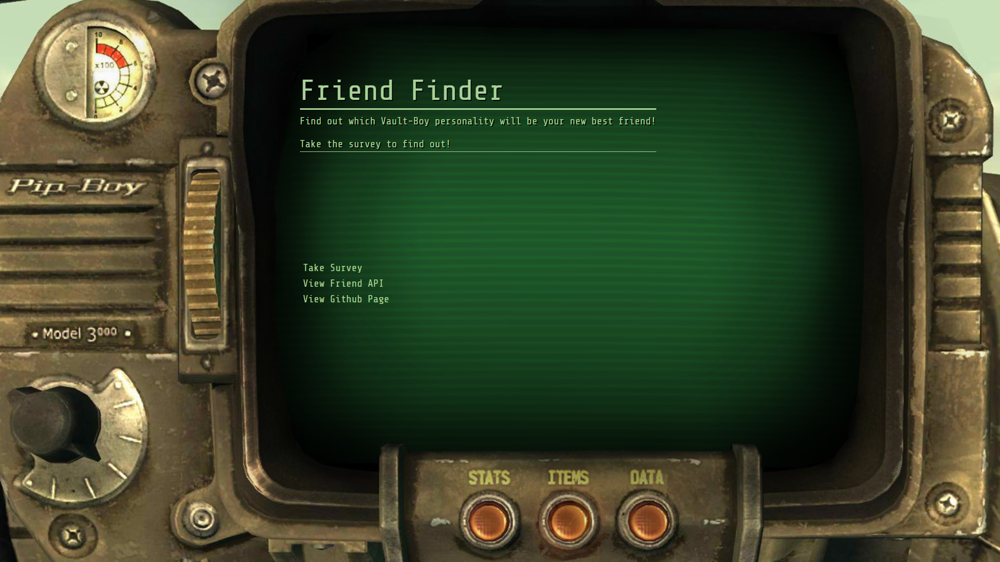
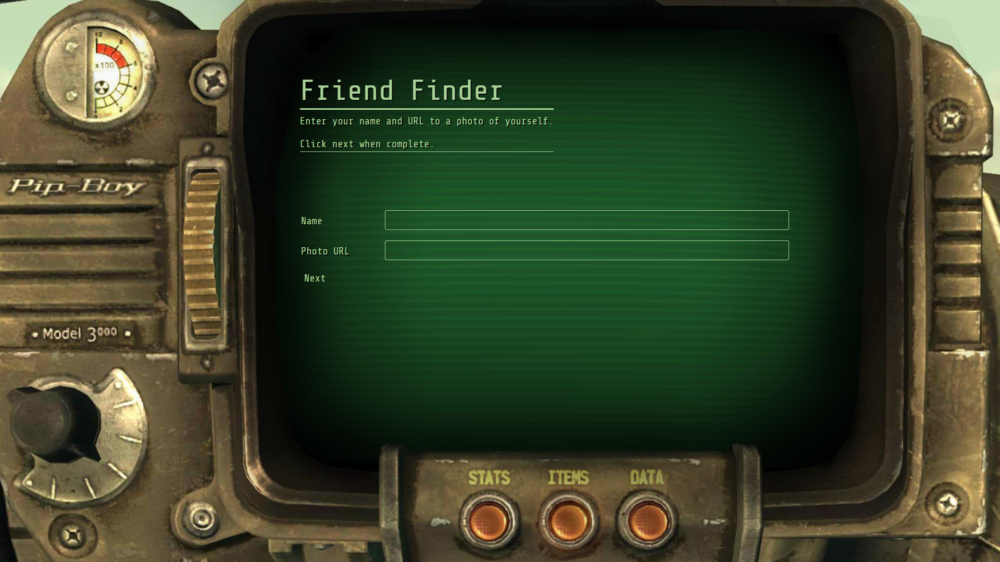
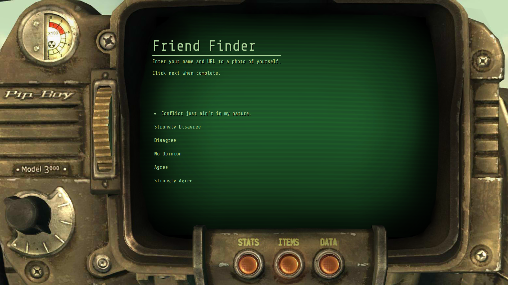
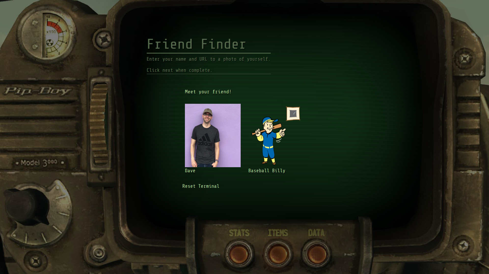

# FriendFinder

Find your new friend with the help of the Pip-Boy 3000!

### Home Screen

- Begin survey by clicking `Take Survey`
- View potential friends and their answers API by clicking `View Friend API`
- View Friend Finder's github page by clicking `View Github Page` 

### Survey

- The survey has two requirements:
    - Enter a name
    - Enter URL address for photo of yourself.

- Click next when both fields have been completed.

- Pip-Boy 3000 ask a series of 5 questions
- Click the answer that suits you best.

### Results

- At the end of the survey, Pip-Boy 3000 will display your photo next to your new friend!
- Click `Reset Terminal` to return to the home screen.

